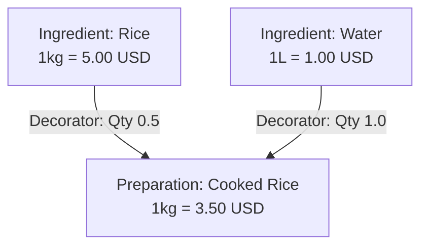

# Source of Truth: Reactive BOM Hierarchy and Preparations Design

ROBOT IDENTIFY ARCHITECTURAL REQUIREMENT:
- All values created/modified via preparations view must be reactive.
- Hierarchy is defined by `ValuesHierarchy`.
- Component ratios and quantities are governed by `ComparisonValueDecorator`.
- Recursive propagation recalculates downstream prices when upstream ingredient prices change.

---

## 1. Domain Entities and Database Schema

### A. Core Values & Comparisons
- **Value (Assembly / Sub-product)**:
  - `type` is either `"made-from"` or `"by-product"`.
  - Linked to a `ComparisonValue` representing its reference price.
  - Automatically gets metadata `REACTIVE_UPDATE = "1"` in `MetaComparisonValue` to signal downstream recalculation.
  
### B. Hierarchy Structure (`ValuesHierarchy`)
- Represents the directed graph of dependencies:
  - `ref_value_top`: Parent value ID (e.g. Raw Rice).
  - `ref_value_bottom`: Child value ID (e.g. Cooked Rice preparation).

### C. Quantity Configuration (`ComparisonValueDecorator`)
- Maps the parent comparison value to the child comparison value:
  - `ref_comparation_values_from`: Parent Comparison ID.
  - `ref_comparation_values_to`: Child Comparison ID.
  - `comparison_decorators`: JSON structure: `{"quantity": <float_value>}`.
  - `is_reactive`: `True` to allow participation in propagation.



---

## 2. API Schema Extension

### Request Schema (`RQValueWithComparison`)
```python
class RQBOMComponent(BaseModel):
    parent_value_id: int
    quantity: float

class RQValueWithComparison(BaseModel):
    value: RQValue
    comparison_value: RQComparisonValue
    ref_super_values_ids: Optional[List[int]] = []
    business_entity_ids: Optional[List[int]] = []
    balance_type: Optional[BalanceType] = None
    components: Optional[List[RQBOMComponent]] = None # <--- NEW FIELD
```

---

## 3. Reactive Propagation Logic

On modification of any comparison value, `recursive_hierarchy_comparison_update` is triggered.
For each reactive child, its new `quantity_to` is calculated:

$$\text{child\_price} = \sum_{p \in \text{Parents}} \left( \frac{\text{parent\_comp.quantity\_to}}{\text{parent\_comp.quantity\_from}} \times \text{decorator.quantity} \right)$$

This is implemented inside `_compute_comparison_update` in `src/domain/services/value_with_comparison.py`.

---

## 4. Frontend Specifications

### A. Categories Filtered
In the preparations view, only the following categories are selectable:
- `made-from` (Assemblies/Preparations)
- `by-product` (By-products)

All other general categories (Ingredient, Utensil, Consumable, Other) are managed strictly on the Inventory page.

### B. UI Lifecycle Flow
1. **Creation Modal**:
   - User inputs: Name, Category, Unit.
   - User clicks Save. Item is stored in the database.
2. **BOM Configuration**:
   - In the preparations table, a "Manage BOM" action is visible for each item.
   - Clicking it opens a modal listing current ingredients/sub-preparations and their quantities.
   - User can add ingredients, set their quantity, or remove components.
   - User clicks Save. Frontend dispatches the updated components list with quantities.
